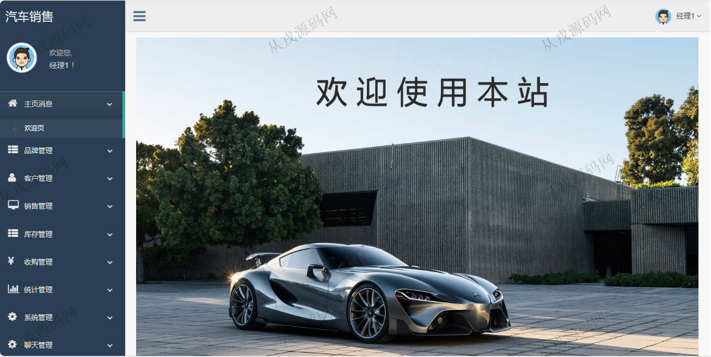
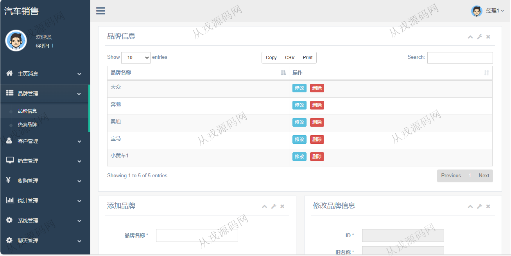
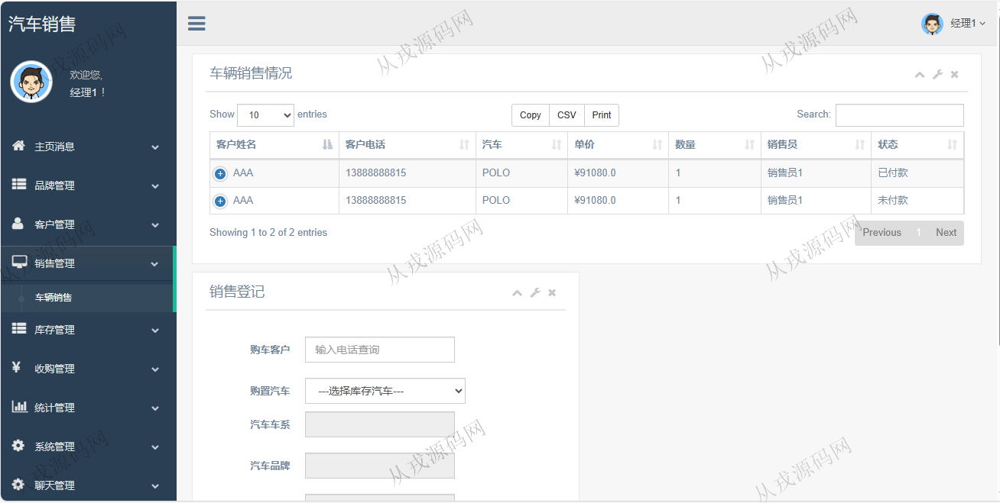
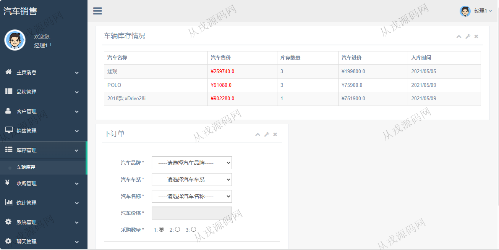
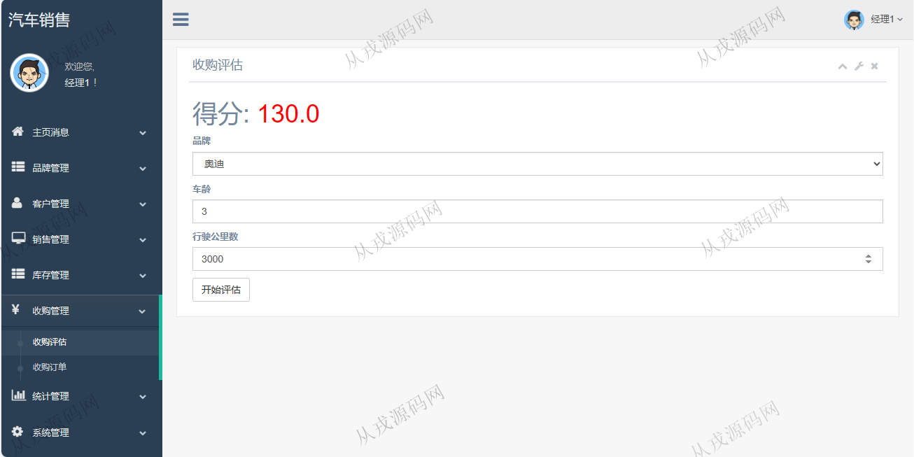
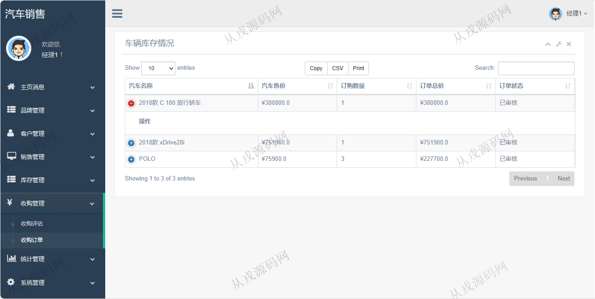
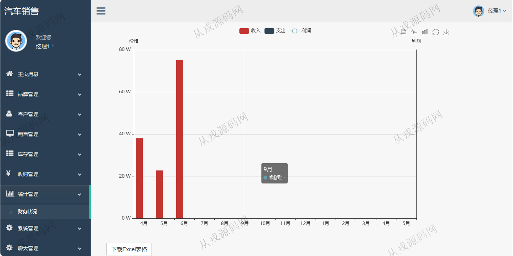
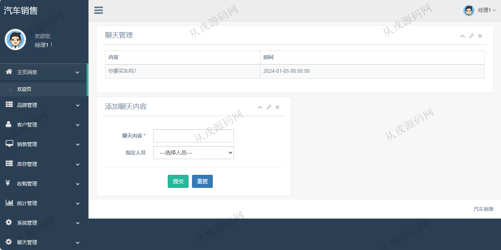

<h1 align="center">107.二手汽车销售管理系统</h1>

- <b>完整代码获取地址：从戎源码网 ([https://armycodes.com/](https://armycodes.com/))</b>
- <b>技术探讨、资料分享，请加QQ群：692619798</b> 
- <b>作者微信：19941326836  QQ：952045282</b> 
- <b>承接计算机毕业设计、Java毕业设计、Python毕业设计、深度学习、机器学习</b>
- <b>选题+开题报告+任务书+程序定制+安装调试+论文+答辩ppt 一条龙服务</b>
- <b>所有选题地址 ([https://github.com/YuLin-Coder/AllProjectCatalog](https://github.com/YuLin-Coder/AllProjectCatalog)) </b>

## 项目介绍
基于ssm的二手汽车销售管理系统【含配套报告文档】：前端 jsp、jquery，后端 maven、springmvc、spring、mybatis，角色分为经理和员工；集成品牌管理、客户管理、销售管理、库存管理、收购管理等功能于一体的系统。

## 功能介绍

- 品牌管理：品牌信息的增删改查，热门品牌列表，销量比较好的顺序排行
- 客户管理：客户资料信息的增删改查
- 销售管理：车辆销售登记，列表查询，付款
- 库存管理：车辆库存情况查询，下订单
- 收购管理：收购评估，收购订单查询
- 统计管理：财务状况（柱状图），下载excel表格
- 员工管理：员工信息的增删改查，账号激活操作
- 聊天管理：聊天内容查看，指定人员发送聊天内容

## 环境

- <b>IntelliJ IDEA 2009.3</b>

- <b>Mysql 5.7.26</b>

- <b>Tomcat 7.0.73</b>

- <b>JDK 1.8</b>

## 运行截图

